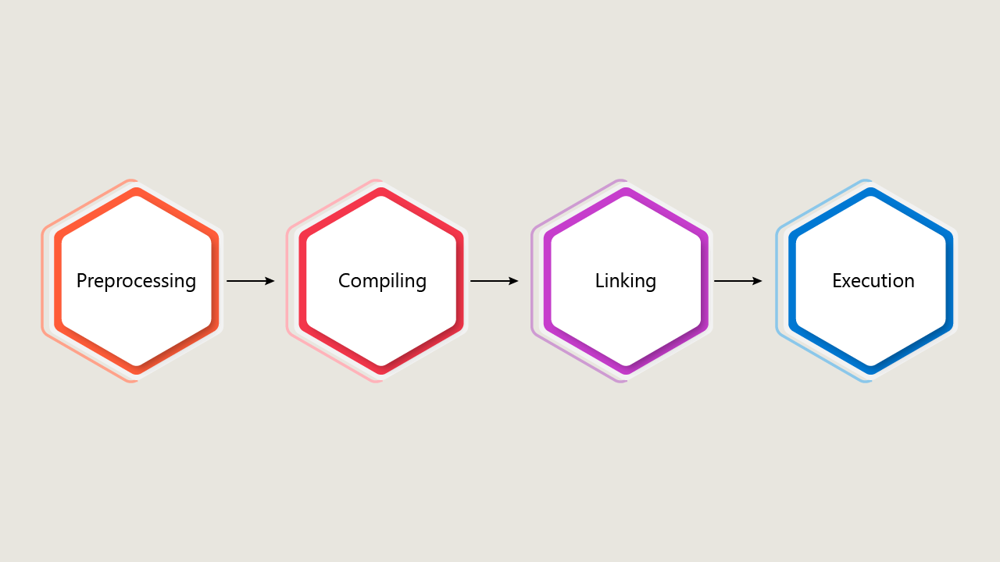

# Program Components, Headers, and Namespaces

## Introduction
Think of C++ components as the building blocks that define how your program runs. Imagine trying to build a complex castle with blocks. Each block has a unique function, contributing to the intricate design of towers and sturdy walls. In C++ programming, program components, headers, and namespaces serve as the building blocks. They shape your code into everything from simple scripts to elaborate software. Understanding these elements is vital as you scale up your coding projects, ensuring efficient management and functionality. In this reading, you'll explore these foundational aspects in depth, preparing you to construct robust programs with ease.

## Program Structure Essentials
At the core of any C++ program are several key components that dictate functionality and organization:

### Preprocessor Directives
Preprocessor directives set the stage for your program before actual compilation begins. They are for the Preprocessor, which performs its actions before compilation, and they usually begin with a '#'. They organize and streamline your code, enhancing reusability and efficiency.




* Definition: Commands like #include that instruct the compiler to include specific files or perform operations before compiling the main code.

* Example:

```cpp
#include <iostream>  // Allows usage of input/output streams
```

### Main Function
The main() function acts like the gatekeeper of your program, dictating where execution starts.

* Definition: The primary function where execution begins; every C++ program requires it.

* Example:

```cpp
int main() {
    return 0;
}
```
### Variable Declarations 

Variables are named storage locations that hold data your program can use and modify throughout execution. A variable declaration establishes a name, data type, and optionally an initial value for storing data.

### Syntax Pattern: 

dataType variableName = initialValue;

### Common Data Types:

```cpp
int studentCount = 30;      // Integer numbers double temperature = 98.6;  // Decimal numbers string courseName = "C++";  // Text strings bool isActive = true;       // True/false values
```
### Example in Context:
```cpp
int main() { string userName;           // Declaration without initialization int score = 0;            // Declaration with initialization
cout << "Enter name: ";
cin >> userName;          // Using the variable
return 0;
}
```

### Headers
Using headers properly can transform a cluttered codebase into an organized, maintainable project.

* Purpose: Facilitate code modularity by declaring functions, variables, and macros externally, which can be used across multiple files for cleaner code. We have been using some of those already defined headers, like <iostream>.

* Example Header File (myHeader.h):
```cpp
#pragma once  // Ensures the header is included only once
void greet();
```
### Example Source File (myHeader.cpp):
```cpp
void greet() {
    std::cout << "Hello from the greet function!" << std::endl;
}
```
## The Role of Namespaces
Namespaces act as labeled containers for your code, preventing naming conflicts and enhancing organization.

### Standard Namespace
The standard namespace, commonly referred to as std, encompasses the C++ standard library functions.

* Usage: Prevents conflicts with standard library names, accessible using the std:: prefix.

* Example:
```cpp
std::cout << "Hello, World!" << std::endl;
```
### Creating Custom Namespaces
Defining your namespaces helps you logically group and manage code segments.

* Definition: Custom namespaces allow you to organize functions, classes, and variables logically.

* Example: 
```cpp
namespace MyApp {
    void display() {
        std::cout << "Displaying from MyApp namespace" << std::endl;
    }
}
```

## Common Pitfalls and Compiler Errors
Navigating errors gracefully is a crucial skill in programming. Recognize these typical mistakes to save time and frustration:

### Missing Headers
Lacking critical headers leads to undefined errors.

* Error Example: ```cpp error: 'cout' is not a member of 'std' ``` highlights a missing #include <iostream> directive.

### Namespace Misuse or Absence
Neglecting namespaces can clutter your code and lead to conflicts.

* Error Example: The directive ```cpp using namespace std```; might cause ambiguities if similar names exist across libraries (precompiled pieces of code, functions, and data structures).

### Malformed Main Function
Errors in ```cpp main() ``` can cause the program to halt execution.

* Error Example: A common signature mistake, like a missing return type (we will go over return types later) in int main() {}, often leads to compiler errors.

## Why These Concepts Matter
Understanding these components is far from just academic; they are industry imperatives.

* Code Maintainability: Efficient use of components reduces clutter, making your code easier to read and maintain, which is crucial for teamwork and personal projects.

* Debugging Efficiency: Clear program structures simplify the debugging process, allowing for fast and accurate troubleshooting.

* Collaboration: A consistent structure, utilizing headers and namespaces, minimizes conflicts, thereby smoothing collaborative efforts.

## Examples
Test the knowledge of interactive C++ coding by integrating what you've learned. See how custom namespaces and headers can shape a program.
```cpp
// myUtils.h
#pragma once
namespace messageUtils {
    void showMessage();
}
// myUtils.cpp
#include "myUtils.h"
#include <iostream>
void messageUtils::showMessage() {
    std::cout << "Message from the utils namespace!" << std::endl;
}
// main.cpp
#include "myUtils.h"
int main() {
    messageUtils::showMessage();
    return 0;
}
```

This example implements a namespace, utils, demonstrating modularity and organization.

## Conclusion
Mastering program components, headers, and namespaces isn’t just about writing better code—it’s about laying the groundwork for efficient, scalable programming. These structural elements enhance your ability to build complex projects, adhere to industry best practices (such as consistent naming, modular design, and style guidelines like the Google C++ Style Guide), and prepare for evolving coding challenges. As you progress on your coding journey, continue to practice and refine these foundational skills to craft clean, professional-grade C++ programs. 

# Componentes del programa, encabezados y espacios de nombres

## Introducción
Piensa en los componentes de C++ como los bloques de construcción que definen cómo se ejecuta tu programa. Imagina que intentas construir un castillo complejo con bloques: cada pieza tiene una función única que contribuye al diseño intrincado de las torres y a la solidez de los muros. En la programación en C++, los componentes del programa, los encabezados (headers) y los espacios de nombres (namespaces) actúan como esos bloques de construcción. Ellos dan forma a tu código, desde simples scripts hasta software elaborado. Comprender estos elementos es vital a medida que escalas tus proyectos de programación, garantizando una gestión y funcionalidad eficientes. En esta lectura, explorarás estos aspectos fundamentales en profundidad, preparándote para construir programas robustos con facilidad.

## Esenciales de la Estructura del Programa
En el núcleo de cualquier programa en C++ se encuentran varios componentes clave que dictan su funcionalidad y organización:

### Directivas de Preprocesador
Las directivas de preprocesador preparan el escenario para tu programa antes de que comience la compilación real. Están dirigidas al preprocesador, el cual realiza sus acciones antes de la compilación, y usualmente comienzan con el símbolo #. Estas directivas organizan y simplifican tu código, mejorando su reutilización y eficiencia.


* Definición: Comandos como `#include` que le indican al compilador que incluya archivos específicos o realice operaciones antes de compilar el código principal.

* Ejemplo:

```cpp
#include <iostream> // Permite el uso de flujos de entrada/salida
```

### Función principal
La función `main()` actúa como el guardián del programa, dictando dónde comienza la ejecución.

* Definición: La función principal donde comienza la ejecución; todo programa de C++ la requiere.

* Ejemplo:

```cpp
int main() {
    return 0;

}
```

### Declaración de Variables

Las variables son ubicaciones de almacenamiento con nombre que contienen datos que tu programa puede usar y modificar durante su ejecución. Una declaración de variable establece un nombre, un tipo de dato y, opcionalmente, un valor inicial para almacenar los datos.

### Patrón de Sintaxis:

Tipo de dato NombreVariable = ValorInicial;

### Tipos de Datos Comunes:

```cpp
int StudentCount = 30; // Número entero double temperature = 98.6; // Número decimal string courseName = "C++"; // Cadena de texto bool isActive = true; // Valores verdadero/falso
```
### Ejemplo en Contexto:
```cpp
int main() { string userName; // Declaración sin inicialización int score = 0; // Declaración con inicialización
cout << "Ingrese el nombre: ";

cin >> userName; // Usando la variable
return 0;

}
```

### Encabezados
Usar correctamente los encabezados puede transformar un código desordenado en un proyecto organizado y mantenible.

* Propósito: Facilitar la modularidad del código declarando funciones, variables y macros externamente, las cuales pueden usarse en varios archivos para un código más limpio. Hemos estado usando algunos de esos encabezados ya definidos, como <iostream>.

* Ejemplo de archivo de encabezado (myHeader.h):
```cpp
#pragma once // Asegura que el encabezado se incluya solo una vez
void greet();
```
### Ejemplo de archivo fuente (myHeader.cpp):
```cpp
void greet() {
    std::cout << "¡Hola desde la función greet!" << std::endl;

}
```

## El papel de los espacios de nombres
Los espacios de nombres actúan como contenedores etiquetados para tu código, evitando conflictos de nombres y mejorando la organización.

### Espacio de nombres estándar
El espacio de nombres estándar, comúnmente conocido como `std`, abarca las funciones de la biblioteca estándar de C++.

* Uso: Evita conflictos con los nombres de la biblioteca estándar, accesibles mediante el prefijo `std::`.

* Ejemplo:
```cpp
std::cout << "¡Hola, mundo!" << std::endl;

```
### Creación de espacios de nombres personalizados
Definir tus espacios de nombres te ayuda a agrupar y gestionar lógicamente los segmentos de código.

* Definición: Los espacios de nombres personalizados te permiten organizar lógicamente funciones, clases y variables.

* Ejemplo:
```cpp
namespace MyApp {
    void display() {
        std::cout << "Mostrando desde el espacio de nombres MyApp" << std::endl;

     }
}
```

## Errores comunes y errores de compilación
Gestionar errores con elegancia es una habilidad crucial en la programación. Reconozca estos errores típicos para ahorrar tiempo y evitar frustraciones:

### Encabezados faltantes
La falta de encabezados críticos provoca errores de tipo `undefined`.

* Ejemplo de error: ```cpp error: 'cout' no es miembro de 'std' ``` resalta la falta de la directiva `#include <iostream>`.

### Mal uso o ausencia de espacios de nombres
Ignorar los espacios de nombres puede saturar el código y provocar conflictos.

* Ejemplo de error: La directiva ```cpp using namespace std```; puede causar ambigüedades si existen nombres similares en distintas bibliotecas (fragmentos de código precompilados, funciones y estructuras de datos).

### Función principal mal formada
Los errores en ```cpp main()``` pueden provocar que el programa se detenga.

* Ejemplo de error: Un error común en la firma, como la falta de un tipo de retorno (veremos los tipos de retorno más adelante) en `int main() {}`, suele provocar errores de compilación.

## Por qué importan estos conceptos
Comprender estos componentes va más allá de lo académico; son imperativos en la industria.

* Mantenibilidad del código: El uso eficiente de componentes reduce el desorden, facilitando la lectura y el mantenimiento del código, algo crucial para el trabajo en equipo y los proyectos personales.

* Eficiencia en la depuración: Las estructuras de programa claras simplifican el proceso de depuración, permitiendo una resolución de problemas rápida y precisa.

* Colaboración: Una estructura consistente, que utiliza encabezados y espacios de nombres, minimiza los conflictos, facilitando así la colaboración.

## Ejemplos
Pon a prueba tus conocimientos de programación interactiva en C++ integrando lo aprendido. Observa cómo los espacios de nombres y los encabezados personalizados pueden dar forma a un programa.

```cpp
// myUtils.h
#pragma once
namespace messageUtils {
    void showMessage();
}
// myUtils.cpp
#include "myUtils.h"
#include <iostream>
void messageUtils::showMessage() {
    std::cout << "¡Mensaje del espacio de nombres utils!" << std::endl;

}
// main.cpp
#include "myUtils.h"
int main() {
    messageUtils::showMessage();
     return 0;

}
```

Este ejemplo implementa un espacio de nombres, utils, demostrando modularidad y organización.

## Conclusión
Dominar los componentes del programa, los archivos de cabecera y los espacios de nombres no se trata solo de escribir mejor código, sino de sentar las bases para una programación eficiente y escalable. Estos elementos estructurales mejoran tu capacidad para crear proyectos complejos, cumplir con las mejores prácticas de la industria (como la nomenclatura coherente, el diseño modular y las guías de estilo como la Guía de Estilo de C++ de Google) y prepararte para los desafíos de programación en constante evolución. A medida que avanzas en tu aprendizaje de programación, continúa practicando y perfeccionando estas habilidades fundamentales para crear programas en C++ limpios y de calidad profesional.