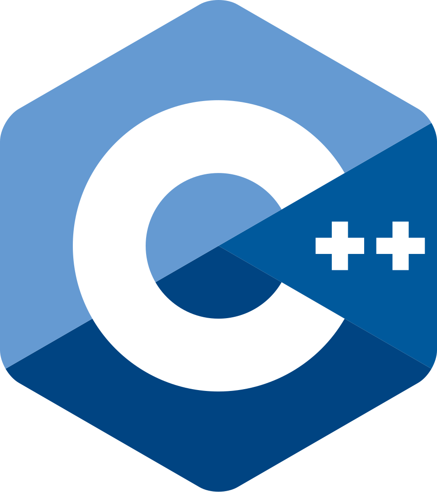

# C++ Programming Fundamentals

---

## 🇺🇸 English Version

Welcome to the **C++ Programming Fundamentals** course repository. This space is designed to take you from the basic syntax to building a functional application.

### 📋 Table of Contents
| Module | Description | Folder |
| :--- | :--- | :--- |
| **01** | **Introduction to C++ Syntax and Structure** | [📂 View Module](./01_syntax_structure) |
| **02** | **Data Types and Variables in C++** | [📂 View Module](./02_data_types_variables) |
| **03** | **Operators and Control Flow** | [📂 View Module](./03_operators_control_flow) |
| **04** | **Code Creation and Compilation** | [📂 View Module](./04_compilation_process) |
| **05** | **Hands-on Course Project** | [📂 View Project](./05_course_project) |

#### 🛠️ Technical Requirements
* **Compiler:** GCC, Clang, or MSVC (C++11 or higher).
* **IDE:** VS Code, CLion, or any text editor.

---

## 🇲🇽 Versión en Español

Bienvenido al repositorio del curso **Fundamentos de Programación en C++**. Este espacio está diseñado para llevarte desde la sintaxis básica hasta la creación de una aplicación funcional.

### 📋 Tabla de Contenidos
| Módulo | Descripción | Carpeta |
| :--- | :--- | :--- |
| **01** | **Introducción a la Sintaxis y Estructura** | [📂 Ver Módulo](./01_syntax_structure) |
| **02** | **Tipos de Datos y Variables en C++** | [📂 Ver Módulo](./02_data_types_variables) |
| **03** | **Operadores y Flujo de Control** | [📂 Ver Módulo](./03_operators_control_flow) |
| **04** | **Creación de Código y Compilación** | [📂 Ver Módulo](./04_compilation_process) |
| **05** | **Proyecto Práctico del Curso** | [📂 Ver Proyecto](./05_course_project) |

#### 🛠️ Requisitos Técnicos
* **Compilador:** GCC, Clang o MSVC (C++11 o superior).
* **IDE:** VS Code, CLion o cualquier editor de texto.

---

## 📥 How to Clone / Cómo Clonar

To get a local copy of this project, follow these steps:
Para obtener una copia local de este proyecto, sigue estos pasos:

### 1. Clone the repository / Clonar el repositorio
Open your terminal and run / Abre tu terminal y ejecuta:
```bash
git clone https://github.com/wr1123/c-_course.git

---
## How to compile and run

### 🛠️ Compile
Open your terminal, navigate to the path where the program.cpp file is located, and run
```bash
g++ program.cpp -o program

### ▶️ Run 
```bash
./program